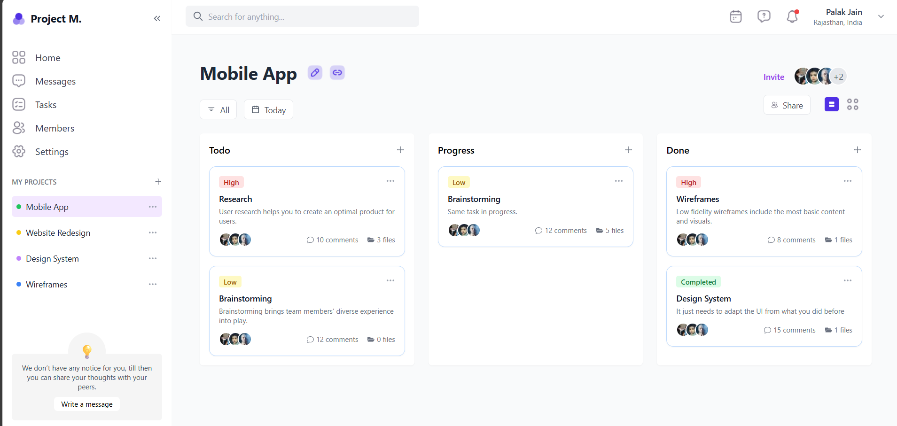
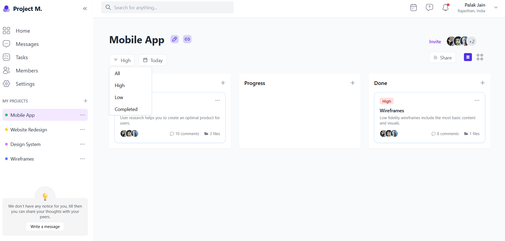
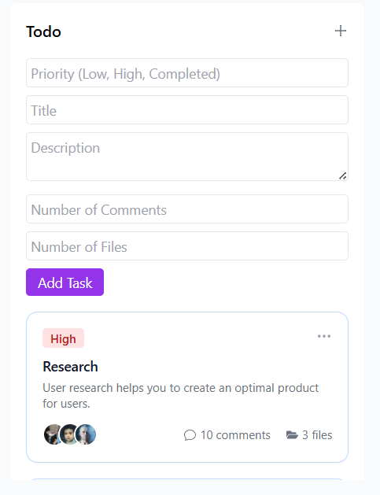
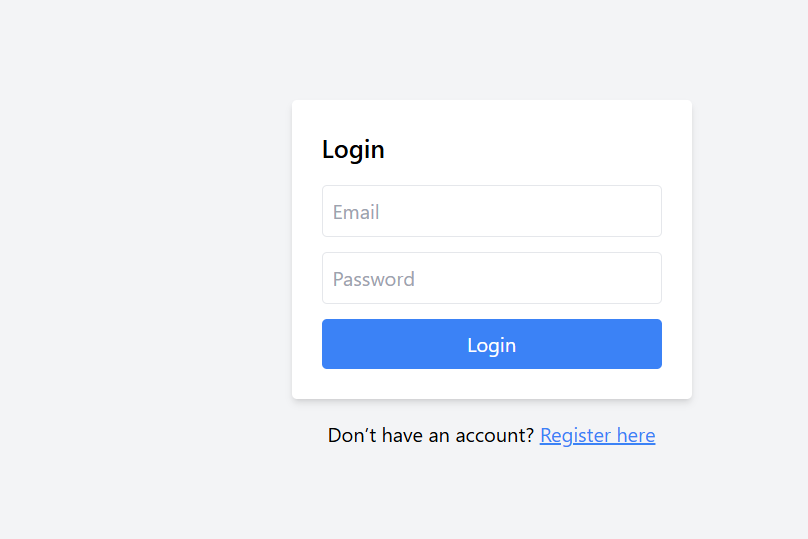
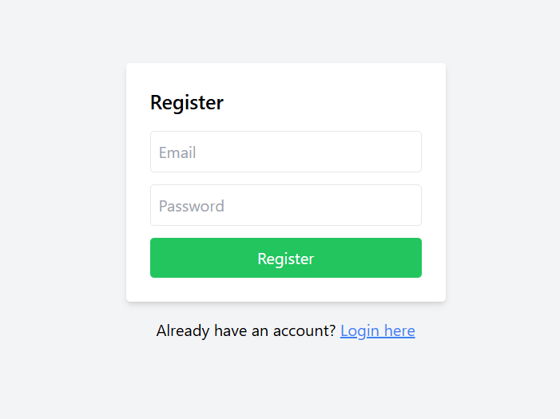

# internshipprojectfrontend
# 🧠 Upaay Dashboard Assignment (Frontend)

This is a React-based implementation of the **Creative Upaay Dashboard** as per the assignment guidelines. It replicates the design from the provided Figma file and implements core functionalities like task management, drag-and-drop, Redux-based state management, filtering, and local storage persistence.
video link- https://www.loom.com/share/3cf0447bf7fd43bdb805ffce943f9ae5?sid=eb787651-c3d1-40d8-b737-35ed46bbfa47
---

## 🔧 Tech Stack

* **React JS**
* **Redux** for state management
* **Local Storage** for state persistence
* **Tailwind CSS** for styling
* **@hello-pangea/dnd** for drag-and-drop
* **UUID** for unique task IDs

---


## 🚀 Features

### ✅ Level 1 (Compulsory)

* **🎨 UI Implementation**
  Fully responsive UI matching the [Figma design](https://www.figma.com/design/2joKVlIEH43PfO9pFfsX51/DASHBOARD-DESIGN-TASK---CREATIVE-UPAAY?node-id=0-1&t=ShcwKcmHcyTqLA5T-1).

* **📝 Add Task**
  Tasks can be added dynamically to any of the three sections. Name and description are input fields; other fields like `due date` and `priority` are hardcoded.

* **📦 Move Tasks Between Sections**
  Implemented using `@hello-pangea/dnd`. Tasks can be dragged from one stage (To Do, In Progress, Done) to another seamlessly.

* **🔍 Task Filtering**
  Tasks can be filtered based on criteria (e.g., priority or section). Filtering is live and state-aware.

* **🧠 Redux State Management + Persistence**
  Application state is managed via Redux and saved to localStorage. State persists after a page refresh.

### ✨ Level 2 (Optional but Implemented)

* **🔐 Authentication (JWT or Firebase)**
  Optional Level 2 feature implemented using JWT. Sign-up and Login functionalities are available.

---


## 🛠️ Installation & Run

```bash
# Clone the repository
git clone https://github.com/your-username/creative-upaay-dashboard.git

# Navigate into the project
cd my-project

# Install dependencies
npm install

# Start the development server
npm run start
```

---

## 📸 Screenshots





## 📦 Deployment

To deploy the app:

```bash
npm run build
```

Then host the `build/` folder using platforms like Vercel, Netlify, or Firebase Hosting.

---

## 🙌 Acknowledgements

* [Figma Design by Creative Upaay](https://www.figma.com/design/2joKVlIEH43PfO9pFfsX51/DASHBOARD-DESIGN-TASK---CREATIVE-UPAAY?node-id=0-1&t=ShcwKcmHcyTqLA5T-1)
* [Tailwind CSS](https://tailwindcss.com/)
* [Redux Toolkit](https://redux-toolkit.js.org/)
* [Hello-Pangea DND](https://github.com/hello-pangea/dnd)

---

## 👤 Author

**Harsh Vardhan Singh**
📧 [harshvardhansinghha@gmail.com](mailto:harshvardhansinghha@gmail.com)
💼 MERN  | AI/ML Enthusiast

---


